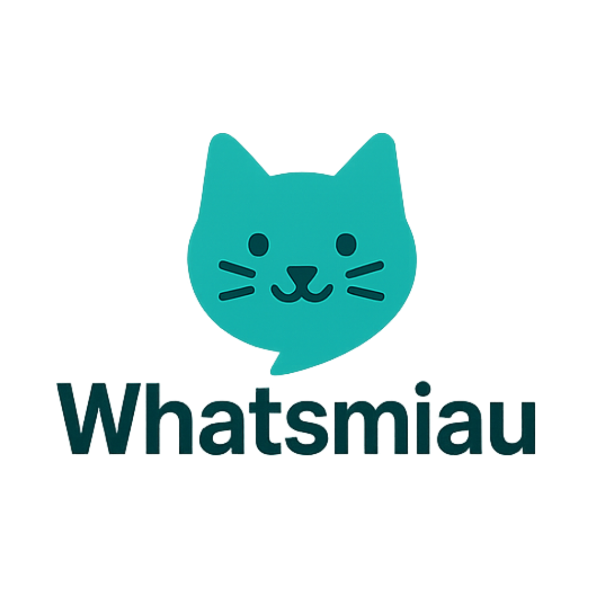

# WhatsMiau



WhatsMiau is a backend service for WhatsApp, built with Go. It uses the Whatsmeow library to connect to WhatsApp and provides an HTTP API to send and receive messages.

[Community Whatsapp (BR)](https://chat.whatsapp.com/FXMrTY552nOBFXU71Be8Zh)
## About The Project

This project provides a robust, scalable, and production-ready solution for integrating WhatsApp functionalities into your applications. It is extremely lightweight, consuming very little memory, making it ideal for resource-constrained environments.

It's designed to be compatible with the Evolution API, making it a flexible choice for developers familiar with that ecosystem.

## Features

- **Lightweight & Efficient:** Optimized for low memory consumption.
- **Production Ready:** Stable and reliable for use in production environments.
- **WhatsApp Integration:** Connects to WhatsApp to send and receive messages.
- **HTTP API:** Exposes an HTTP API for easy integration with other services.
- **Redis Support:** Uses Redis for session storage and caching.
- **SQLite Database:** Utilizes SQLite for persistent data storage.
- **Environment-based Configuration:** Easily configure the application using environment variables.
- **Structured Logging:** Implements structured logging with Zap for better monitoring and debugging.

## Getting Started

To get a local copy up and running follow these simple steps.

### Prerequisites

- Go 1.18 or higher
- Redis
- SQLite

### Installation

1. Clone the repo
   ```sh
   git clone https://github.com/verbeux-ai/whatsmiau.git
   ```
2. Install Go packages
   ```sh
   go mod tidy
   ```
3. Set up your environment variables by copying `.env.example` to `.env` and filling in the required values.
   ```sh
   cp .env.example .env
   ```
4. Run the application
   ```sh
   go run main.go
   ```

## Configuration

The application is configured using environment variables. The following variables are available:

| Variable      | Description                               | Default     |
|---------------|-------------------------------------------|-------------|
| `PORT`        | The port the server will run on.          | `8080`      |
| `DEBUG_MODE`  | Enable or disable debug mode.             | `false`     |
| `REDIS_ADDR`  | The address of the Redis server.          | `localhost:6379` |
| `REDIS_PASS`  | The password for the Redis server.        | ``          |
| `REDIS_DB`    | The Redis database to use.                | `0`         |
| `DATABASE_URL`| The path to the SQLite database file.     | `data.db`   |


## Compatibility

This API is designed to be compatible with the Evolution API. This means that you can use clients and tools designed for the Evolution API with this project.

It exclusively supports webhooks in the Evolution API format, offering two distinct approaches for their implementation, providing flexibility for different use cases.

## API Routes
Same Pattern: https://www.postman.com/agenciadgcode/evolution-api/overview
| Method | Path                                      | Description                 |
|--------|-------------------------------------------|-----------------------------|
| POST   | /v1/instance                            | Create a new instance       |
| GET    | /v1/instance                            | List all instances          |
| POST   | /v1/instance/:id/connect                | Connect to an instance      |
| POST   | /v1/instance/:id/logout                 | Logout from an instance     |
| DELETE | /v1/instance/:id                        | Delete an instance          |
| GET    | /v1/instance/:id/status                 | Get instance status         |
| POST   | /v1/instance/:instance/message/text     | Send a text message         |
| POST   | /v1/instance/:instance/message/audio    | Send an audio message       |
| POST   | /v1/instance/:instance/message/document | Send a document             |
| POST   | /v1/instance/:instance/message/image    | Send an image message       |
| POST   | /v1/instance/:instance/chat/presence    | Send chat presence          |
| POST   | /v1/instance/:instance/chat/read-messages| Mark messages as read       |

### Evolution API Compatibility Routes

| Method | Path                               | Description                 |
|--------|------------------------------------|-----------------------------|
| POST   | /v1/instance/create                | Create a new instance       |
| GET    | /v1/instance/fetchInstances        | List all instances          |
| GET    | /v1/instance/connect/:id           | Connect to an instance      |
| GET    | /v1/instance/connectionState/:id   | Get instance status         |
| DELETE | /v1/instance/logout/:id            | Logout from an instance     |
| DELETE | /v1/instance/delete/:id            | Delete an instance          |
| POST   | /v1/message/sendText/:instance     | Send a text message         |
| POST   | /v1/message/sendWhatsAppAudio/:instance | Send an audio message       |
| POST   | /v1/message/sendMedia/:instance    | Send a media message        |
| POST   | /v1/chat/markMessageAsRead/:instance | Mark messages as read       |
| POST   | /v1/chat/sendPresence/:instance    | Send chat presence          |

## Supported Events

The application can send webhook events for the following actions:

| Event             | Description                                         |
|-------------------|-----------------------------------------------------|
| `MESSAGES_UPSERT` | Triggered when a new message is received.           |
| `MESSAGES_UPDATE` | Triggered when a message status changes (e.g., read). |
| `CONTACTS_UPSERT` | Triggered when a contact is created or updated.     |
